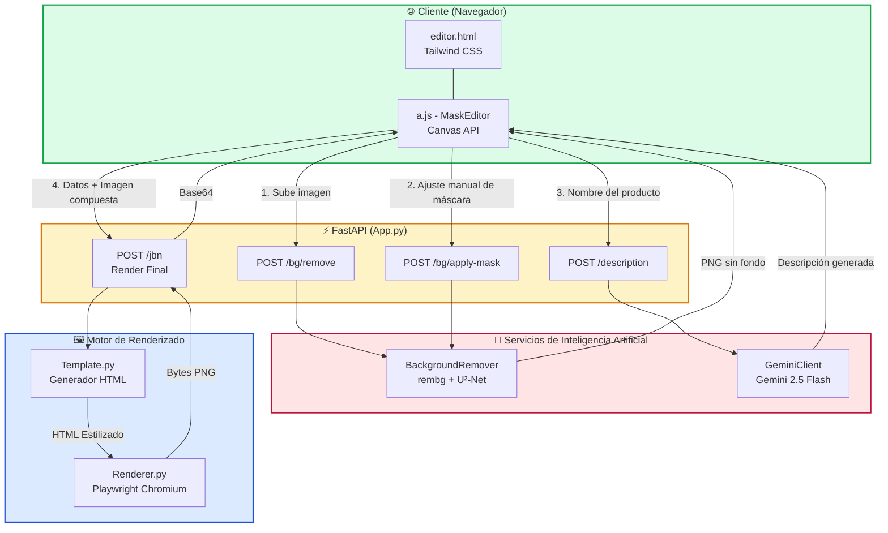
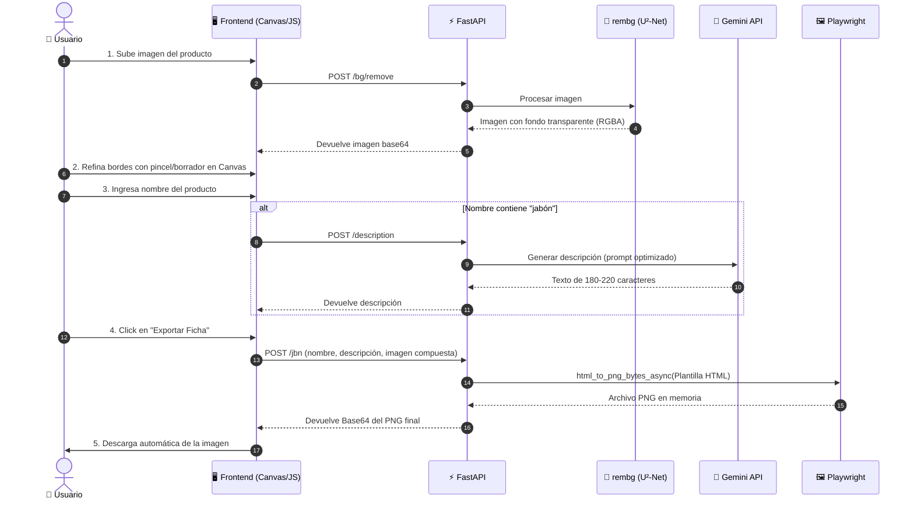

# 🎨 Banner Front - Editor Interactivo de Fichas de Producto

> **📌 Nota del Ecosistema:** Este repositorio representa la **evolución web e interactiva** del proyecto [`creator_banner`](https://github.com/MartinCiro/creator_banner). Mientras que `creator_banner` es el motor lógico/binario para generación automatizada en lote, `banner_front` proporciona una interfaz visual para el **control de calidad humano**, permitiendo refinar recortes y previsualizar resultados antes de la exportación final.

Una aplicación web Full-Stack autocontenida construida con **FastAPI**, **HTML5 Canvas** y **Tailwind CSS**, diseñada para generar fichas visuales de productos (ej. jabones artesanales) combinando Inteligencia Artificial para la remoción de fondo, generación de texto y renderizado de plantillas HTML a imagen.

---

## 🚀 Características Principales

- 🧠 **Remoción de Fondo con IA**: Integración con `rembg` (modelo U²-Net) para segmentación y eliminación automática del fondo.
- 🖌️ **Editor de Máscaras Interactivo (Human-in-the-loop)**: Implementación personalizada en JavaScript (`MaskEditor`) sobre HTML5 Canvas que permite al usuario hacer zoom, paneo y refinar manualmente los bordes del recorte (pincel de añadir/borrar) si la IA no fue perfecta.
- 🤖 **Generación de Contenido con LLM**: Uso de la API de **Gemini 2.5 Flash** para generar descripciones de producto optimizadas y con longitud controlada (ej. detección contextual de palabras clave como "jabón").
- 🖼️ **Renderizado HTML a PNG**: Uso de **Playwright (Chromium)** en modo headless para "fotografiar" una plantilla HTML estilizada (con la imagen procesada, texto generado y decoraciones SVG) y exportarla como un banner final de alta calidad.
- 🐳 **100% Dockerizado**: Configuración lista para producción que resuelve todas las dependencias complejas del sistema (fuentes, librerías gráficas, caché de modelos) para un despliegue reproducible.

---

## 🏗️ Arquitectura del Sistema

La aplicación sigue un patrón de inyección de dependencias en FastAPI, separando claramente la capa de presentación (HTML/JS), la lógica de control (API), los servicios de IA y el motor de renderizado.



---

## 🔄 Flujo de Trabajo del Usuario



---

## 📂 Estructura del Proyecto

```text
banner_front/
├── controller/
│   ├── App.py                # 🌐 Enrutamiento FastAPI e inyección de dependencias
│   ├── Config.py             # ⚙️ Carga de variables de entorno (.env)
│   ├── GeminiClient.py       # 🤖 Cliente de IA generativa (Gemini 2.5 Flash)
│   ├── BackgroundRemover.py  # 🧠 Lógica de remoción de fondo con U²-Net
│   ├── BackgroundRemoverAPI.py # Endpoints específicos para /bg/*
│   ├── Template.py           # 📝 Generador de plantillas HTML dinámicas
│   ├── Renderer.py           # 🖼️ Conversión asíncrona de HTML a PNG (Playwright)
│   └── Log.py                # 📜 Sistema de logging estructurado
├── static/
│   ├── a.js                  # 🖌️ MaskEditor v2.0: Lógica pura de Canvas (zoom, pan, historial, pincel)
│   └── st.css                # 🎨 Estilos específicos del editor
├── templates/
│   └── editor.html           # 🖥️ Interfaz de usuario completa (Tailwind CDN)
├── docker-compose.yml        # 🐳 Orquestación con volúmenes para hot-reload y caché
├── Dockerfile                # 📦 Imagen con dependencias del sistema (fuentes, libgl, etc.)
├── requirements.txt          # 📋 Dependencias de Python
└── README.md                 # 📖 Este archivo
```

---

## 🛠️ Instalación y Despliegue

Debido a las dependencias nativas requeridas por `rembg` (ONNX Runtime) y Playwright (navegadores y fuentes del sistema), **se recomienda encarecidamente usar Docker**.

### Opción 1: Despliegue con Docker (Recomendado)

1. Clona el repositorio:
   ```bash
   git clone https://github.com/MartinCiro/banner_front.git
   cd banner_front
   ```

2. Configura tus variables de entorno:
   Crea un archivo `.env` en la raíz del proyecto:
   ```env
   # 🔑 Gemini API (Obligatorio para generación de descripciones)
   GEMINI_API_KEY=tu_api_key_de_google_ai_studio
   GEMINI_MODEL=gemini-2.0-flash-exp

   # 🖼️ Render (Playwright)
   RENDER_WIDTH=920
   RENDER_HEIGHT=380

   # 🎨 Template (UI)
   FONT_FAMILY=Montserrat
   PRIMARY_COLOR=#6b2348
   BG_COLOR=#fdf6f6
   ```

3. Construye y levanta el contenedor:
   ```bash
   docker compose up --build -d
   ```
   > *Nota: El `Dockerfile` descarga automáticamente el modelo `u2net` (~170MB) y los navegadores de Playwright durante la construcción, y el `docker-compose.yml` persiste estas cachés en volúmenes para futuros reinicios rápidos.*

4. Accede a la aplicación en tu navegador:
   ```text
   http://localhost:8000/editor
   ```

### Opción 2: Ejecución Local (Linux / macOS)

Si prefieres ejecutarlo sin Docker, debes instalar manualmente las dependencias del sistema:

```bash
# 1. Instalar dependencias del sistema (Ubuntu/Debian)
sudo apt update
sudo apt install -y libgl1 libglib2.0-0 libsm6 libxext6 libxrender1 libgomp1 \
                    fonts-dejavu-core fonts-liberation fonts-noto-core fontconfig

# 2. Crear y activar entorno virtual
python3 -m venv venv
source venv/bin/activate

# 3. Instalar dependencias de Python
pip install -r requirements.txt

# 4. Descargar modelo de rembg y navegadores de Playwright
python -c "from rembg import new_session; new_session('u2net')"
playwright install chromium

# 5. Ejecutar el servidor
uvicorn main:app --reload --host 0.0.0.0 --port 8000
```

---

## 🔌 Endpoints de la API

| Método | Ruta | Descripción |
| :--- | :--- | :--- |
| `GET` | `/editor` | Sirve la interfaz de usuario (`editor.html`). |
| `POST` | `/bg/remove` | Recibe una imagen, aplica `rembg` y devuelve el PNG sin fondo. |
| `POST` | `/bg/apply-mask` | Aplica una máscara binaria generada en el Canvas del cliente sobre la imagen original. |
| `POST` | `/description` | Genera una descripción de producto usando Gemini (con lógica condicional de prompt). |
| `POST` | `/jbn` | Recibe nombre, descripción e imagen compuesta; renderiza la plantilla HTML vía Playwright y devuelve el PNG final en Base64. |

---

## 💡 Diferencias Clave: `banner_front` vs `creator_banner`

| Característica | `creator_banner` (Binario/Logic) | `banner_front` (Web Interactiva) |
| :--- | :--- | :--- |
| **Propósito** | Generación automatizada, en lote y sin supervisión. | Generación asistida con **control de calidad visual humano**. |
| **Interacción** | Línea de comandos o ejecución en segundo plano. | Interfaz gráfica con Canvas, zoom, paneo y herramientas de pincel. |
| **Manejo de Errores de IA** | Asume que el recorte de la IA es perfecto. | Permite al usuario **corregir manualmente** los bordes del recorte antes de exportar. |
| **Caso de Uso** | Procesamiento masivo de catálogos. | Creación de fichas de producto de alta calidad para marketing o e-commerce. |

---

## 👤 Autor

**Martin Ciro**  
[](https://github.com/MartinCiro)

---
*Desarrollado con Python, FastAPI, HTML5 Canvas e Inteligencia Artificial. Una solución pragmática que combina la velocidad de la IA con la precisión del control humano.*